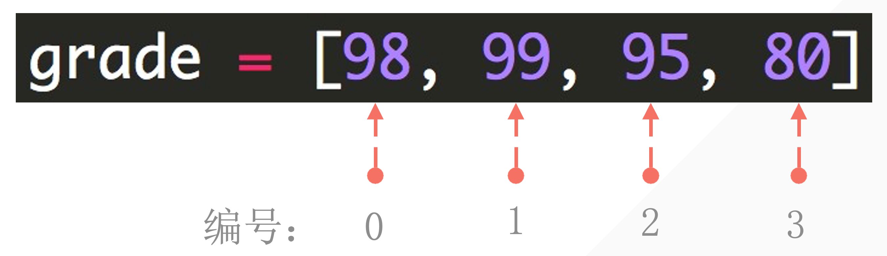
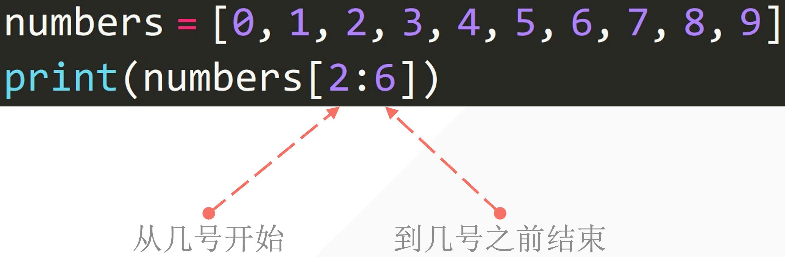

# 1. 列表結構

· 利用 中括號 表示列表

· 列表内的元素用 逗號 隔開

· 注意是 英文輸入法 下的逗號

```python
student1 = ['lilei', 18, 'class01', 201901]
student2 = ['hanmeimei', 19, 'class2', 201902]
print(student1)
print(student2)

# ---output---
['lilei', 18, 'class01', 201901]
['hanmeimei', 19, 'class2', 201902]
```

列表的 可变性：可以修理列表的内容。

· 字符串强制轉換成列表

```python
string_to_list = list('Bornforthis')
print(string_to_list)

# ---output---
['B', 'o', 'r', 'n', 'f', 'o', 'r', 't', 'h', 'i', 's']
```

# 2. 獲取列表中的某個元素


## 2.1. 列表下標的組成

編程語言中通常 第一個位置的編號是0。



## 2.2. 提取單個元素

中括號内數字指定元素位置

```python
grade = ['hanmeimei', 19, 'class02', 201902]
print(grade[-1])  # 98

# ---output---
201902
```

## 2.3. 獲取列表中連續的幾個元素



· 中括號内用 起姑位置：結束位置 描述

· 注意：不包括結束位置的元素

```python
numbers = [0, 1, 2, 3, 4, 5, 6, 7, 8, 9]
print(numbers[2:6])  # [2, 3, 4, 5]

# ---output---
[2, 3, 4, 5]
```

· 更細緻的用法起始位置：結束位置：步長

· 注意：不包括結束位置的元素

```python
numbers = [0, 1, 2, 3, 4, 5, 6, 7, 8, 9]
print(numbers[1:7:2])  # [1, 3, 5]

# ---output---
[1, 3, 5]
```

```python
numbers = ['a', 'b', 'c', 'd', 'e', 'f', 'g', 'h', 'i', 'j']
print(numbers[0:11:2])  # [1, 3, 5]

# ---output---
['a', 'c', 'e', 'g', 'i']
```

```python
student2 = ['a', 'b', 'c', 'd', 'e', 'f', 'g', 'h', 'i', 'j']
print(student2)

student2[3:] = list('12345')
print(student2)

# ---output---
['a', 'b', 'c', 'd', 'e', 'f', 'g', 'h', 'i', 'j']
['a', 'b', 'c', '1', '2', '3', '4', '5']
```

