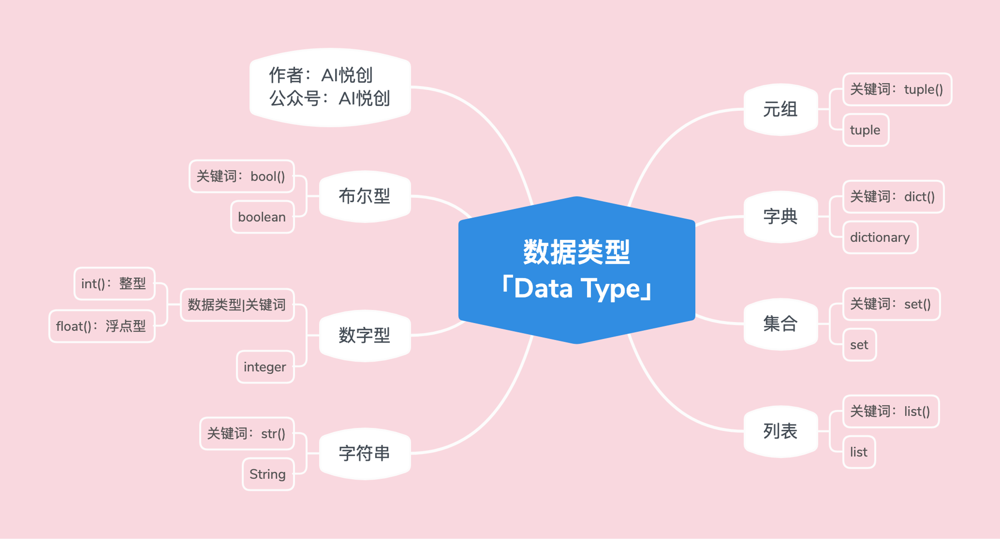
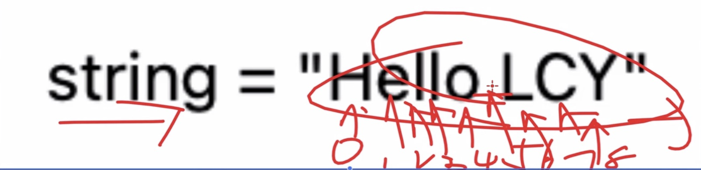
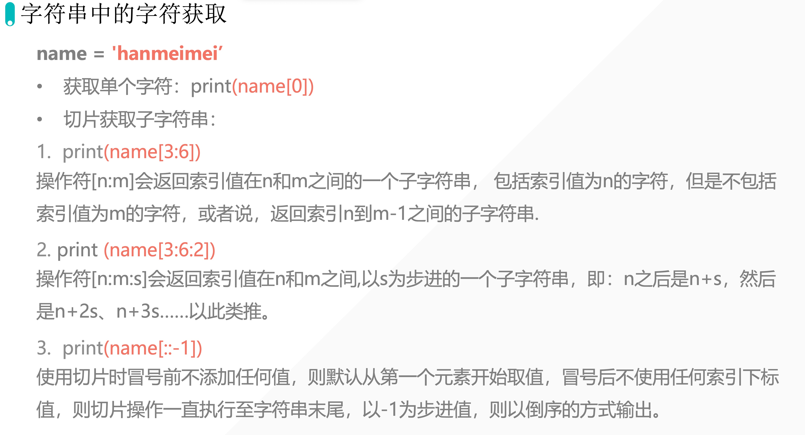

```python
int_num = 1
t = type(int_num)
print(int_num)
print("int num type is:>>>", t)
print("直接检测数据类型, 并输出:>>>", type(int_num))

# ---output---
1
int num type is:>>> <class 'int'>
```

```python
float_num = 1.5
t = type(float_num)
print(float_num)
print("float num type is:>>>", t)
print("直接检测数椐类型, 并输出:>>>", type(float_num))

# ---output---
1.5
float num type is:>>> <class 'float'>
直接检测数椐类型, 并输出:>>> <class 'float'>

```

# 2.字符串「str」

## 2.1 代码示例

```python
string = " Hello LCY"
t = type(string)
print(string)
print("string type is:>>>", t)
print("直接检测数椐类型, 并输出:>>>", type(string))

#---output---
 Hello LCY
string type is:>>> <class 'str'>
直接检测数椐类型, 并输出:>>> <class 'str'>
```

## 2.2字符串三大特性

1.有序性

1. 「从左到右，下标是从 0 开始」；

2. 「从右到左，小标是从 -1 开始」；

3.  引号里面出现的，都算一个下标 ；




```python
s = "I'm lilei"   # 单双引号混用
print(s)

#
```

```python
s = """
"Hello,AIYC!
Hello,would！"  # 单双引号不支持多行
"""
print(s)  #三个单引号和两个双引号, 支持多行文本。
```

## 2.3字符串長度

len()函數：返回字符串的字符长度或者字符数。

```python
s1 = 'hello world'
s2 = 'aiyuechuang'
print(len(s1))
print(len(s2))

#---output---
11
11
```



```python
s = "aiveuchuang"
select = s[0]  # 提取字符 a
print(select)vsc

#---output---
a
```

```python
s = "hugo is cool"
select = s[-1]
print(select)

#---output---
l
```

```python
s = "hugo is cool"
#提取多个数据

#提取：Hug
select = s[0:3] #←这里一定要加一
print(select)


---output---
hug
```

```python
s = "hugo is  cool"
select = s[5:7]
print(select)

#---output---
# is
```

```python
s = "hugo is  cool"
select = s[5:9]
print(select)

#---output---
#is c
```

```python
s = "0123456789"
select = s[1:10:2]
print(select)

---output---
# 13579
```

```python
s = "0123456789"
select = s[0:9:2]
print(select)

#---output---
# 02468
```

```python
s = hello world
select = s[11]
print(select)

# ---output---
# d
```

