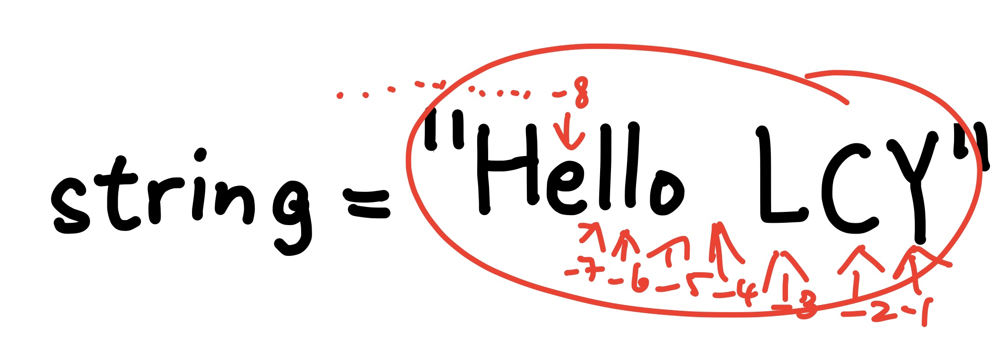
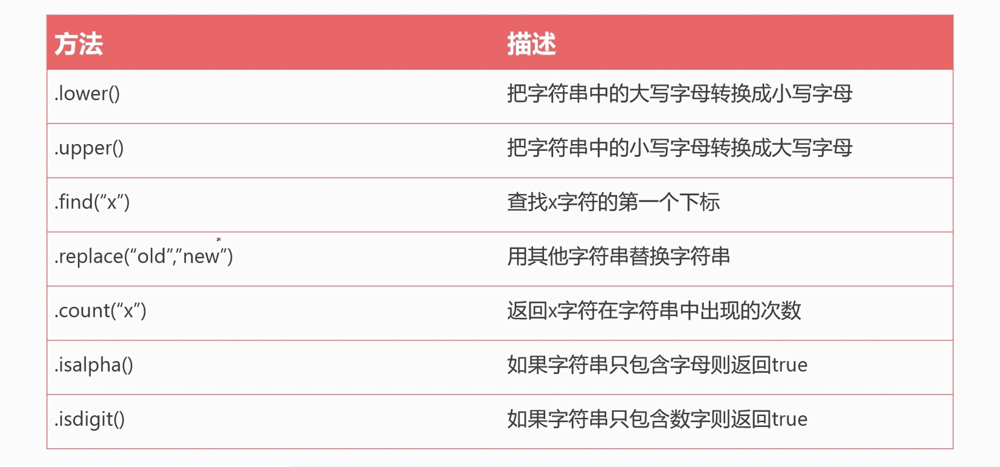

```python
int_num = 1
t = type(int_num)
print(int_num)
print("int num type is:>>>", t)
print("直接检测数据类型, 并输出:>>>", type(int_num))

# ---output---
1
int num type is:>>> <class 'int'>
```

```python
float_num = 1.5
t = type(float_num)
print(float_num)
print("float num type is:>>>", t)
print("直接检测数椐类型, 并输出:>>>", type(float_num))

# ---output---
1.5
float num type is:>>> <class 'float'>
直接检测数椐类型, 并输出:>>> <class 'float'>

```

# 2.字符串「str」

## 2.1 代码示例

```python
string = " Hello LCY"
t = type(string)
print(string)
print("string type is:>>>", t)
print("直接检测数椐类型, 并输出:>>>", type(string))

#---output---
 Hello LCY
string type is:>>> <class 'str'>
直接检测数椐类型, 并输出:>>> <class 'str'>
```

## 2.2字符串三大特性

1.有序性

1. 「从左到右，下标是从 0 开始」；

2. 「从右到左，小标是从 -1 开始」；

3.  引号里面出现的，都算一个下标 ；




```python
s = "I'm lilei"   # 单双引号混用
print(s)

#
```

```python
s = """
"Hello,AIYC!
Hello,would！"  # 单双引号不支持多行
"""
print(s)  #三个单引号和两个双引号, 支持多行文本。
```

## 2.3字符串長度

len()函數：返回字符串的字符长度或者字符数。

```python
s1 = 'hello world'
s2 = 'aiyuechuang'
print(len(s1))
print(len(s2))

#---output---
11
11
```


```python
s = "aiveuchuang"
select = s[0]  # 提取字符 a
print(select)vsc

#---output---
a
```

```python
s = "hugo is cool"
select = s[-1]
print(select)

#---output---
l
```

```python
s = "hugo is cool"
#提取多个数据

#提取：Hug
select = s[0:3] #←这里一定要加一
print(select)


---output---
hug
```

```python
s = "hugo is  cool"
select = s[5:7]
print(select)

#---output---
# is
```

```python
s = "hugo is  cool"
select = s[5:9]
print(select)

#---output---
#is c
```

```python
s = "0123456789"
select = s[1:10:2]
print(select)

---output---
# 13579
```

```python
s = "0123456789"
select = s[0:9:2]
print(select)

#---output---
# 02468
```

```python
s = hello world
select = s[11]
print(select)

# ---output---
# d
```


```python
s = "hugo lucky"

# 字符串倒序輸出
select = s[::-1]
print(select)

# ---output---
# ykcul oguh
```

```python
s = "0123456789"    # " <- 這個是引號  ❗❗❗ : <- 這個是冒號  ⭐⭐⭐⭐⭐
select = s[0:10:2]
print(select)

# ---output---
# 02468
```



```python
s = "hugo liu"
new_s = s.upper() # 把字符串變成大寫
print(new_s)

# ---output---
# HUGO LIU
```

```python
s = "HUGO LIU"
new_s = s.lower() # 把字符串變成小寫
print(new_s)

# ---output---
# hugo liu 
```

```python
s = "hugohugoliuliu"
new_s = s.count("u")  # 計算字符 u 在字符串 s 中出現的次數
print(new_s)

# ---output---
# 4
```

```python
s = "hugohugoliuliu"
new_s = s.count("l")  # 計算字符 l 在字符串 s 中出現的次數
print(new_s)

# ---output---
# 2
```

```python
s = "hugohugoliuliu"
new_s = s.isalpha()  # 判斷字符串是不是純字母字符串
print(new_s)

# ---output---
# True
```

```python
s = "look"
new_s = s.startswith("l")
print(new_s)

# ---output---
# True
```

```python
s = "look"
new_s = s.endswith("o")
print(new_s)

# ---output---
# False
```

```python
s = "1 2 3 4 5 6 7 8"
new_s = s.split(" ")
print(new_s)

# ---output---
# ['1', '2', '3', '4', '5', '6', '7', '8']
```

```python
s = "1、2、3、4、5、6、7、6" # 字符串以空格分割
# split 以什麼
new_s = s.split("、")
print(new_s)

# ---output---
# ['1', '2', '3', '4', '5', '6', '7', '6']
```

```python
s = " hugo "
# 默認去除字符串左右空白字符，可以指定要去除的字符
new_s = s.strip()
print(new_s)

# ---output---
# hugo
```

```python
s = "--- hugo ---"
new_s = s.strip("-")
print(new_s)

# ---output---
#  hugo 
```

```python
s = "--- hugo ---"
new_s = s.strip("- ")
print(new_s)

# ---output---
# hugo
```

```python
s = "hugo hugo gogo"

new_s = s.replace("g","L")
print(new_s)

# ---output---
# huLo huLo LoLo
```

```python
s = "hugo hugo gogo"
new_s = s.lstrip("o")
print(new_s)

# ---output---
# hugo hugo gogo
```

```python
s = "hugo hugo gogo"
new_s = s.rstrip("o")
print(new_s)

# ---output---
# hugo hugo gog
```

```python
s = "hello {}, Welcome to {}."
new_s = s.format("cava", "XiaMen") # 在多個花括號的時候，依次填入
print(new_s)
```

```python
s = "hello {name}, Welcome to {adders}"
new_s = s.format(name="sss", adders="xiamen") # 指定參數傳入
print(new_s)

# ---output---
# hello sss, Welcome to xiamen
```

```python
strting = "hugo huis coll"
new_s  = strting.split(' ') #以空格分割，返回列表
print(new_s)

# ---output---
#C:\Users\TUNG\PycharmProjects\Coder\venv\Scripts\python.exeC:\Users\TUNG\PycharmProjects\Coder\Day\法進行替換.py 
# ['hugo', 'huis', 'coll']

# 进程已结束,退出代码0
```

```python
strting = "hugo huis coll"
new_s  = strting.isdigit()
# TODO： 判斷字符串是不是純數字字符串，但凡出現數字之外的字符都是 False
print(new_s)

string = "123234435"
new_s =  string.isdigit()
print(new_s)

string = "123234435a"
new_s = string.isdigit()
print(new_s)

string = "hugo-huis-coll"
# TODO: 判斷字符串是不是以純字母創建，但凡出現非字母的，結果都為 False
new_s = string.isalpha()
print(new_s)

string = "hugohuiscoll"
new_s = string.isalpha()
print(new_s)

# ---output---
# False
# True
# False
# False
# True
```

```python
string = "12aiyc"
new_string = string.isalnum()
# todo: 判斷字符串是不是純數字或純字母，數字字母字符串
print(new_string)

string = "12"
new_string = string.isalnum()
# todo: 判斷字符串是不是純數字或純字母，數字字母字符串
print(new_string)

string = "aiyc"
new_string = string.isalnum()
# todo: 判斷字符串是不是純數字或純字母，數字字母字符串
print(new_string)

# ---output---
# True
# True
# True
```

```python
# 判斷字符串是不是純數字字符串，字符串中但凡有一個字符是非數字，則返回 False。

string = '12345678'
result = string.isdigit()
print(result)

# ---output---
True
```

```python
# 判斷字符串是不是純字母字符串，字符串中但凡有一個字符是非字母，則返回 False。

string = 'bornforthis'
result = string.isalpha()
print(result)

# ---output---
True
```

```python
# 判斷字符串是不是純字母字符串，字符串中但凡有一個字符是非字母，則返回 False。

string = 'bornforthis1'
result = string.isalpha()
print(result)

#---output---
False
```

```python
# 判斷字符串是不是純字母字符串，字符串中但凡有一個字符是非字母，則返回 False。

string = "bornforthis"
boolean = string.isalnum()
print(boolean)

#---output---
True
```

```python
string = "BORNFORTHIS"
boolean = string.isupper()
print(boolean)

# ---output---
True
```

```python
string = "BORNFORTHIS12-"
boolean = string.isupper()
print(boolean)

# ---output---
True
```

```python
string = "BORNforthis"
boolean = string.isupper()
print(boolean)

# ---output---
False
```

```python
string = "bornforthis"
boolean = string.isupper()
print(boolean)

# ---output---
False
```

```python
string = "bornforthis"
boolean = string.islower()
print(boolean)

#---output---
True
```

```python
string = "bornforthis121-"
boolean = string.islower()
print(boolean)

# ---output---
True
```

```python
string = "bornforthisA121-"
boolean = string.islower()
print(boolean)

# ---output---
False
```

```python
string = "  "
boolean = string.isspace()
print(boolean)

# ---output--
True
```

```python
string = ""
boolean = string.isspace()
print(boolean)

# ---output---
False
```

```python
string = "  bornforthis  "
strip_string = string.strip()
print(strip_string)

# ---output---
True
```

Code link：https://code.bornforthis.cn/?id=ecc86773-b974-4a34-833a-18a6e1b1a8df

```python
# .strip()
"""
默认去掉目标字符串的前后空白字符，如果指定参数，则去掉指定字符。
"""
string = "   bornforthis   "
strip_string = string.strip()
print("原本的字符串:", string)
print("去掉前后空白字符后:", strip_string)


string = "-----bornforthis-----"
strip_string = string.strip('-')
print("原本的字符串:", string)
print("去掉前后 '-' 字符后:", strip_string)


string = "--- --bornforthis-- ---"
strip_string = string.strip('-')  # 只去掉连续的减号
print("原本的字符串:", string)
print("去掉前后 '-' 字符后:", strip_string)


string = "--- --bornforthis-- ---"  # 如果想去掉减号和空格呢？
strip_string = string.strip('- ')  # 填入要去掉的字符「不计较先后顺序」
print("原本的字符串:", string)
print("去掉前后 '- ' 字符后:", strip_string)
```

```python
# .lstrip()
"""
默认去掉字符串左边的空白字符，如果指定参数，则去掉左边的指定字符。
"""
string = "   bornforthis   "
lstrip_string = string.lstrip()
print("原本的字符串:", string)
print("去掉左边空白字符后:", lstrip_string)

# ---output---
原本的字符串:    bornforthis   
去掉左边空白字符后: bornforthis   


string = "----bornforthis----"
lstrip_string = string.lstrip('-')
print("原本的字符串:", string)
print("去掉左边 '-' 后:", lstrip_string)


# ---output---
原本的字符串: ----bornforthis----
去掉左边 '-' 后: bornforthis----

string = "-- --bornforthis----"
lstrip_string = string.lstrip('- ')  # 不分先后顺序
print("原本的字符串:", string)
print("去掉左边 '- ' 后:", lstrip_string)

# ---output---
原本的字符串: -- --bornforthis----
去掉左边 '- ' 后: bornforthis----
```


## .rstrip()

默认去掉字符串右边的空白字符，如果指定参数，则去掉右边的指定字符。

```python
string = "   bornforthis   "
rstrip_string = string.rstrip()
print("原本的字符串:", string)
print("去掉右邊空白字符后:", rstrip_string)

string = "----bornforthis----"
rstrip_string = string.rstrip('-')
print("原本的字符串:", string)
print("去掉右邊'-'字符后:", rstrip_string)

string = "   bornforthis   "
rstrip_string = string.rstrip('- ') # 不分先後順序
print("原本的字符串:", string)
print("去掉右邊 '- ' 字符后:", rstrip_string)

# ---output---
# 原本的字符串:    bornforthis   
# 去掉右邊空白字符后:    bornforthis
# 原本的字符串: ----bornforthis----
# 去掉右邊'-'字符后: ----bornforthis
# 原本的字符串:    bornforthis   
# 去掉右邊 '- ' 字符后:    bornforthis

```


## replace()

.replace(old, new, count) 第一个位置传入待替换的旧「old」字符，第二个位置传入要替换的新字符「new」，默认替换全部，count 控制替换次数。

```python
string = "   bornforthis   "
replace_string = string.replace(' ', '*')   # 把空白字符替換成 *
print("原本的字符串:",string)
print("替換后:", replace_string)

string = "ai-bornforthis-ai"
replace_string = string.replace('at', 'love')   # 把 ai 替換成 love,默認全部替換
print("原本的字符串:",string)
print("替換后:", replace_string)

string = "ai-bornforthis-ai"
replace_string = string.replace('at', 'love')   # 替換一次
print("原本的字符串:",string)
print("替換后:", replace_string)

# ---output--- 
#C:\Users\TUNG\PycharmProjects\Coder\venv\Scripts\python.exe C:\Users\TUNG\PycharmProjects\Coder\Day\受到懲罰.py 
#原本的字符串:    bornforthis   
#替換后: ***bornforthis***
#原本的字符串: ai-bornforthis-ai
#替換后: ai-bornforthis-ai
#原本的字符串: ai-bornforthis-ai
#替換后: ai-bornforthis-ai

#进程已结束,退出代码0
```

## split()

.split(sep, maxsplit) 以特定字符进行分割，默认空格分割。如果传入参数「sep」，则以参数进行分割。返回分割后的列表。maxsplit 用于控制分割几次。

```python
string = "ai bornforthis ai"
split_string = string.split()
print("原本的字符串:", string)
print("分割后：", split_string)

string = "ai-bornforthis-ai"
split_string = string.split("-")
print("原本的字符串:", string)
print("分割后：", split_string)

string = "ai-bornforthis-love"
split_string = string.split('-',1)
print("原本的字符串:", string)
print("分割后：", split_string)

# ---output---
#原本的字符串: ai bornforthis ai
#分割后： ['ai', 'bornforthis', 'ai']
#原本的字符串: ai-bornforthis-ai
#分割后： ['ai', 'bornforthis', 'ai']
#原本的字符串: ai-bornforthis-love
#分割后： ['ai', 'bornforthis-love']
```

## .rsplit()

.rsplit(sep, maxsplit) 从字符串右边进行分割，也可以传入参数「sep」，进行指定分割。返回分割后的列表。maxsplit 指定分割次数。

```python
string = "ai-bornthis-love"
rsplit_string = string.rsplit('-')
print("原本的字符串:", string)
print("分割后：", rsplit_string)

string = "ai-bornthis-love"
rsplit_string = string.rsplit('-',1)
print("原本的字符串:", string)
print("分割后：", rsplit_string)

# ---output---
#原本的字符串: ai-bornthis-love
#分割后： ['ai', 'bornthis', 'love']
#原本的字符串: ai-bornthis-love
#分割后： ['ai-bornthis', 'love']
```

## .join()

```python
string = "bornforthis"
join_string = '-'.join(string)
print("原本的字符串:", string)
print("分割后：", join_string)


# ---output---
#原本的字符串: bornforthis
#分割后： b-o-r-n-f-o-r-t-h-i-s
```

# 6.字符串格式化

```python
string = "Hi Bornforthis,welcome to XianMen"
print(string)

# ---output---
# Hi Bornforthis,welcome to XianMen
```

所存在的问题：需要换一个人名或者地区，就需要重新创建一个全新的字符串。

我们更希望有类似模版，让我们不同的人名、地面填写进去。而不是每个人都从头创建一个新字符串。

当然，这个时候有可能会想到使用字符串的加法，但字符串加法存在问题。

```python
name = "Bornforthis"
region = "XiaMen"
string1 = "Hi "
string2 = ",Welcome to"
string3 = "."
rseult = string1 + name + string2 + region + string3
print(rseult)

# ---output---
# Hi Bornforthis,
```

```python
string = "momey is" + 190
print(string)

# ---output---
Traceback (most recent call last):
  File "C:\Users\TUNG\PycharmProjects\Coder\Day\iuU.py", line 1, in <module>
    string = "momey is" + 190
TypeError: can only concatenate str (not "int") to str


string = "momey is " + str(190)
print(string)

# ---output---
momey is 190
```

### 6.1 .format()

1.單個花括號 {}

```python
string = "hi {},Welcome to XiaMen.".format("aiyuechuang")
print(string)

# ---output---
Hi aiyuechuang,Welcome to XiaMen


print(template_string.format("Bornforthis"))
template_string = "My {},Welcome to XizMen"

# ---output---
My Bornforthis,Welcome to XizMen


template_string = "My {},Welcome to XizMen"
new_string = template_string.format("AI悅創")
print(new_string)

#---output---
Hi AI悅創,Welcome to XizMen
```

2.一個花括號以上「按顺序填充」

```python
string = "Hi {},Welcome to {}.".format("aiyuechuang","廈門")
print(string)

# ---output---
Hi aiyuechuang,Welcome to 廈門.


template_string = "Hi {},Welcome to {}"
print(template_string.format("Bornforthis","上海"))

# ---output---
Hi Bornforthis,Welcome to 上海

new_string = template_string.format("AI悅創", "北京")
print(new_string)

#---output---
Hi AI悅創,Welcome to 北京
```

```python
string = "Hi {1},Welcome to {0}.".format("廈門","aiyuecguang")
print(string)

template_string = "Hi {1},Welcome to {0}."
print(template_string.format("上海","Bornforthis"))

new_string = template_string.format("北京","AI悅創")
print(new_string)

# ---output---
# Hi aiyuecguang,Welcome to 廈門.
# Hi Bornforthis,Welcome to 上海.
# Hi AI悅創,Welcome to 北京.
```

4.參數指定   d=====(￣▽￣*)b

```python
string = "Hi {name}, Welcome to {region}.".format(region='廈門',name='aiyuchuang')
print(string)

template_string = "Hi {name},Welcome to {region},"
print(template_string.format(name="bornforthis",region='上海'))

new_string = template_string.format(name='AI悅創',region='上海')
print(new_string)

# ---output---
#Hi aiyuchuang, Welcome to 廈門.
#Hi bornforthis,Welcome to 上海,
#Hi AI悅創,Welcome to 上海,
```

5.保留指定小數位    ( •̀ ω •́ )y

```python
string = "Money is {:.3f}.".format(190)
print(string)

# ---output---
# Money is 190.000.
```

### 6.2f

1.直接讀取變量  ᓚᘏᗢ

```python
name = "bornforthis"
region = "廈門"
string = f"Hi {name},Welcome to {region}"
print(string)

# ---output---
# Hi bornforthis,Welcome to 廈門
```

2.保留小數位

```python
money = 190
string = f"Money is {money:.3f}."
print(string)

# ---output---
# Money is 190.000.
```

### 6.3% 格式化

· %d : 整數

· %s : 字符串

· #f : 浮點數

1.單個位置轉入

```python
string = "Money is %d"
new_s = string % 13
print(new_s)
print(string % 19)
string = "Money is %d" % 190
print(string)

# ---output---
#Money is 13
#Money is 19
#Money is 190
```

2.多個位置傳入

```python
string = "Money is %d %s"
new_s = string % (13, '發大財')
print(new_s)
print(string % (888,'暴富'))
string = "Money is %d %s" % (190, "超有錢")
print(string)

#---output---
Money is 13 發大財
Money is 888 暴富
Money is 190 超有錢
```

3.保留小數位

```python
string = "Money is %.3f"
new_s = string % 19
print(new_s)
print(string % 18)
string = "Money is %.3f" % 180
print(string)

#---output---
Money is 19.000
Money is 18.000
Money is 180.000
```

### 6.4f和format，%的優缺點

format 和 % 都像模板，提前做好后有需要試可以直接使用；

而 f 就像在銀行當中，櫃員邊問你邊登記，不能提前做好模板


## 7. 字符串不可變形

字符串是不可變的，不可以改變字符串中的任何元素，如需改變字符串中的元素，则需要新建一个字符串。

```python
s = "hello bornforthis"
s[0] = "a"

# ---output---
C:\Users\TUNG\PycharmProjects\Coder\venv\Scripts\python.exe C:\Users\TUNG\PycharmProjects\Coder\Day\【發票.py 
Traceback (most recent call last):
  File "C:\Users\TUNG\PycharmProjects\Coder\Day\【發票.py", line 2, in <module>
    s[0] = "a"
TypeError: 'str' object does not support item assignment

进程已结束,退出代码1
```

除了使用 replace 還可以使用字符串拼接：

```python
s = "hello botnforthis"
news = "a" + s[1:]
print(news)

# ---output---
C:\Users\TUNG\PycharmProjects\Coder\venv\Scripts\python.exe C:\Users\TUNG\PycharmProjects\Coder\Day\【發票.py 
aello botnforthis

进程已结束,退出代码0
```

## 8. 字符串轉義

| 轉義字符 | 含義                              | 例子                   |
| :------- | --------------------------------- | ---------------------- |
| \\\      | 反斜杠符號，為了在字符串中得到 \\ | s = “bor\\\nforthis”   |
| \b       | 退格，類似刪除鍵                  | s = “bornff\borthis”   |
| \n       | 換行                              | s = “bornfor\nthis”    |
| \t       | 制表符                            | s = “boen\tfor\tthis”  |
| r        | 取消轉義「R 和 r」都可以          | s = r”born\tfor\tthis” |

示例代碼：

```python
s = "bor\\nforthis"
print(s)

# ---output---
bor\nforthis


s = "bornff\borthis"
print(s)

# ---output---
bornforthis


s = "bornfor\nthis"
print(s)

# ---output---
bornfor
this


s = "born\tfor\tthis"
print(s)

# ---output---
born	for	  this
```

## 9. 字符串的連接

```python
s1 = 'born'
s2 = 'forthis'
print(s1 + s2)  # 形成了一個字符串
print(s1,s2)  # 還是兩個獨立的字符串

# ---output---
bornforthis
born forthis


s1 = '*-love-'
print(s1 * 10)

# ---output---
*-love-*-love-*-love-*-love-*-love-*-love-*-love-*-love-*-love-*-love-
```

我想在上面的輸出添加未尾一個*怎么办呢 ?

```python
原本：*-love-*-love-*-love-*-love-*-love-*-love-*-love-*-love-*-love-*-love-
目標：*-love-*-love-*-love-*-love-*-love-*-love-*-love-*-love-*-love-*-love-*
```

思考一下，如何實現。

```python
s1 = '*-love-'
print(s1 * 10, end='*')

s1 = '*-love-'
s2 = '*'
print(s1 * 10 + s2)

# ---output---
*-love-*-love-*-love-*-love-*-love-*-love-*-love-*-love-*-love-*-love-*
*-love-*-love-*-love-*-love-*-love-*-love-*-love-*-love-*-love-*-love-*
```

## 10. 讀取用戶輸入

###  10.1 input() 基本使用

使用  input()  獲取用戶輸入

```python
user_input = input('Enter yuor name:>>>')
print("user input name:", user_input)

# ---output---
Enter yuor name:>>> Bornforthis
user input name:  Bornforthis
```

### 10.3 input() 的特點

#### 10.3.1 input() 得到類型皆為字符串「str」

```
```

