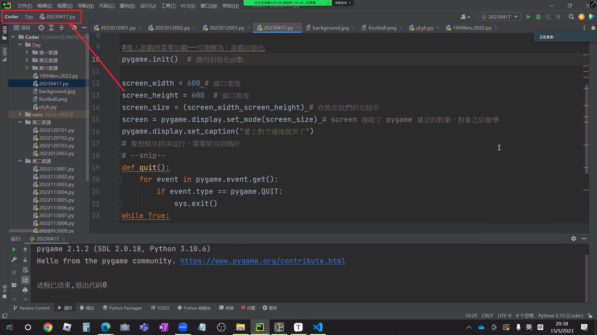
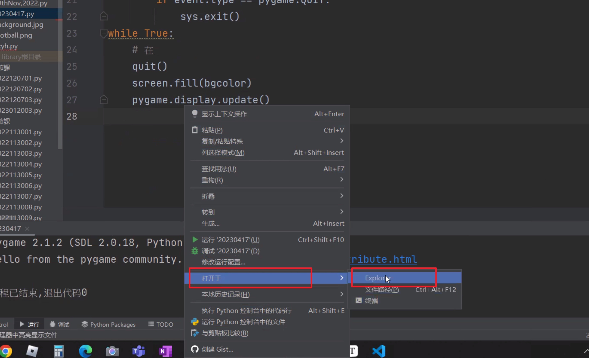

**2.3涉及的单词**

- ·def:define, 定义函数，英语：给……下定义，解释；轮廓；是...... 特征，为...... 的特色

## 0. 目录

- 载入图片、调整大小

- 图片显示规则

- 足球反弹

    第一步：揿1下day

    第2步：揿两下20230417

    这样就可以在左上角看到路径



------------------------------------------------------------------------------------------------------------------------------------------------------------------------------------

揿一下右键，按打开于，再按Explorer，就可以打开路径



_1._如果你想制造自己的简历，便可以参考以下代码

---

```python
username = input("請輸入您的姓名：_______")
gender = input("請輸入您的性別：_______")
age = input("請輸入您的年龄:_______")
school = input("請輸入您的學校:_______")
print("正在生成您的簡歷...")
print("---------------------------------------")
print("\t简历")
print("姓名：",username)
print("性別：",gender)
print("年龄：",age)
print("學校:",school)
```


